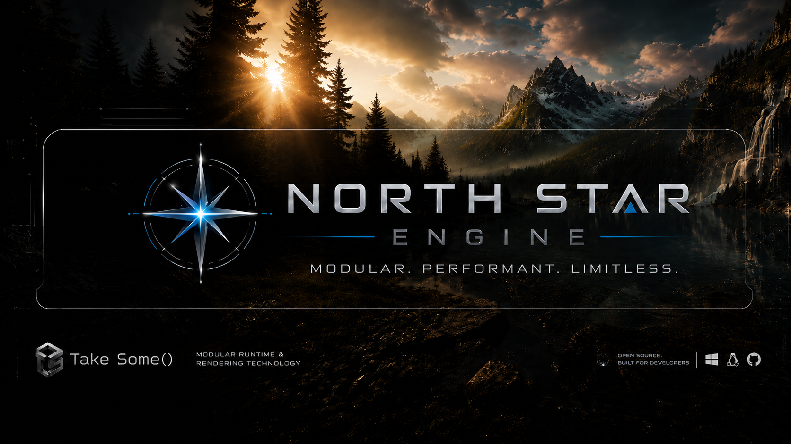

<p align="center">
  
</p>

# NorthStar Engine

[](.github/workflows/ci.yml)
[](https://www.rust-lang.org/)
[](#continuous-integration)
[](neocore2/docs/architecture/composition-v2.md)
[](#project-status)
[](LICENSE)

**NorthStar Engine** is a modular game-runtime technology stack developed by **Take Some()**.
The repository contains the Rust host/kernel, public engine APIs, runtime composition layer, content/runtime systems, editor-facing infrastructure, and executable validation gates used to assemble NorthStar instances.

NorthStar is deliberately **provider-neutral**. The kernel is not a wrapper around one renderer, one physics SDK, one UI backend, or one asset implementation. Concrete providers are discovered and composed at runtime through declared capabilities and contracts.

A valid NorthStar host can start with **zero provider modules** and run with a degraded capability set. Render, physics, UI, audio, assets, gameplay, and other domains become available only when the selected composition supplies them.

```text
application / project
        |
        v
HostContext + Engine kernel
        |
        v
discovery inventory
        |
        v
RuntimeContractCatalog
        |
        v
CompositionSolver
        |
        v
frozen CompositionPlan
        |
        v
ActiveGatewayRegistry
        |
        v
engine.* gateways
        |
        v
selected provider services / runtime systems
```

## Project identity

| Field | Current value |
| --- | --- |
| Product | NorthStar Engine |
| Organization | Take Some() |
| Repository | `Take-Some/NewEngine` |
| Primary language | Rust |
| Main workspace | `neocore2/` |
| Standalone launcher | `NewEngine` (`newengine` package `0.1.2`) |
| Kernel | `newengine-host-kernel` / `newengine-core` |
| Runtime orchestration | `newengine-runtime-host`, `newengine-engine-runtime` |
| Composition model | Composition V2: inventory -> solver -> frozen plan -> gateway materialization |
| Plugin ABI | native `PluginDescriptorV2` + capability metadata |
| Contract authority | static normative registry + per-instance `RuntimeContractCatalog` |
| License | Apache License 2.0 |
| Status | Pre-alpha / active API and runtime development |

## Core architecture

NorthStar separates **host authority**, **public contracts**, **runtime orchestration**, and **provider implementation**.

```text
newengine-contract-api
newengine-contract-registry
newengine-runtime-contract-catalog
                |
                v
newengine-service-api <-> newengine-plugin-api
                |
                v
newengine-plugin-host
                |
        CompositionSolver
                |
                v
newengine-core / newengine-host-kernel
                |
                v
newengine-runtime-host
                |
                v
engine.* typed domain APIs and runtime systems
```

### Architectural invariants

- **Discovery is inventory, not selection authority.** Discovery enumerates descriptors, capabilities, tags, contracts, versions, origins, and runtime units.
- **`CompositionSolver` owns provider selection.** Alternative providers are resolved by the shared composition model, not by domain-specific `if renderer == ...` branches.
- **Composition freezes before authoritative loading.** After freeze, loaders verify the selected artifacts instead of silently choosing replacements.
- **Consumers use `engine.*` gateways.** Concrete provider service IDs remain implementation metadata.
- **The contract catalog is instance-scoped.** Engine-owned contracts stay normative; plugins may publish extension contracts without replacing the trust root.
- **Provider absence is valid by default.** A host with no staged modules remains a valid composition unless a project/profile explicitly requires a capability or plugin ID.
- **Instance shutdown is instance-local.** Process-wide shutdown is an explicit operation rather than an implicit side effect of stopping one host.
- **Runtime policy consumes the captured `HostContext`.** Process environment is a bootstrap input, not hidden mutable runtime state.
- **Editor/runtime composition uses the same contract and provider-selection authority.**

The normative composition contract is documented in [`composition-v2.md`](neocore2/docs/architecture/composition-v2.md).

## Public API surface

NorthStar does not expose one monolithic `engine` crate. Public boundaries are split into small domain/API crates and stable gateway identities.

### Composition and host APIs

| Crate | Version | Responsibility |
| --- | ---: | --- |
| `newengine-service-api` | `0.1.0` | Canonical `engine.*` gateway vocabulary, service identity, tags, requirements, resolver contracts |
| `newengine-plugin-api` | `0.1.0` | Stable plugin ABI, `PluginDescriptorV2`, capability descriptors, discovery metadata, runtime contract declarations |
| `newengine-contract-api` | `0.1.0` | Contract identity, versions, compatibility semantics |
| `newengine-runtime-provider-api` | `0.1.0` | Runtime-facing provider contracts |
| `newengine-runtime-unit-api` | `0.1.0` | Declarative runtime-unit provides/requires model |
| `newengine-runtime-session-api` | `0.1.0` | Runtime session boundary |
| `newengine-host-capabilities-api` | `0.1.0` | Host hardware/platform capability snapshot API |
| `newengine-core` | `0.1.0` | Engine lifecycle, resources, scheduling, startup/readiness graph, plugin phase ownership |
| `newengine-host-kernel` | `0.1.0` | Minimal runnable host with no domain providers required |
| `newengine-engine-runtime` | `0.3.0` | Engine/gameplay runtime orchestration without concrete backend ownership |

### Engine gateway domains

The canonical gateway namespace is owned by `newengine-service-api`. Domain crates re-export or extend the public contracts without creating provider-specific compatibility paths.

| Domain | Canonical gateways / examples | Primary API crates |
| --- | --- | --- |
| Assets | `engine.assets`, `.vfs`, `.types`, `.inspect`, `.edit`, `.packages`, `.listfiles`, `.uid`, `.dependencies`, `.import_queue`, `.package_writer`, `.maps`, `.validation`, `.ui`, `.materials`, `.definitions`, `.graph`, `.models`, `.streaming` | `newengine-assets-api`, `newengine-model-domain-api` |
| Render | `engine.render`, `.effects`, `.materials`, `.draw_lists`, `.hair.*`, `engine.render.vfx` | `newengine-render-api`, `newengine-render-feature-api`, `newengine-vfx-api` |
| Physics | `engine.physics`, `.contacts`, `.constraints` | `newengine-physics-api`, `newengine-physics-world-api` |
| UI | `engine.ui`, `.text`, `.debug`, `.notify`, `engine.ui.loading` | `newengine-ui-api`, `newengine-text-api`, `newengine-loading-api`, `newengine-ui-navigation-api` |
| Input | `engine.input`, `.actions`, `.bindings`, `.contexts` | `newengine-input-api`, `newengine-input-actions-api`, `newengine-input-bindings-api`, `newengine-input-contexts-api`, `newengine-input-capture-api` |
| Audio | `engine.audio` plus provider-neutral world/acoustics boundary DTOs | `newengine-audio-api` `0.9.1`, `newengine-audio-world-api` `0.9.1` |
| World / scene | `engine.world`, `engine.world.environment`, `engine.world.streaming`, `engine.scene` | `newengine-world-api`, `newengine-world-environment-api`, `newengine-world-runtime-api`, `newengine-world-authoring-api`, `newengine-scene-authoring-api` |
| Camera | `engine.camera` | `newengine-camera-api` |
| AI / navigation | `engine.ai`, `engine.navigation` | `newengine-ai-api`, `newengine-navigation-api` |
| Animation | `engine.animation` | `newengine-animation-api` |
| ECS / entity / tags | `engine.ecs`, `engine.entity`, `engine.tags` | `newengine-ecs-api`, `newengine-entity-api`, `newengine-tags-api` |
| Networking | `engine.network`, `engine.replication` | `newengine-network-api`, `newengine-replication-api` |
| Platform / host | `engine.platform`, `engine.host.capabilities`, `engine.time`, `engine.threading`, `engine.tasks` | `newengine-platform-api`, `newengine-host-capabilities-api`, `newengine-time-api`, `newengine-task-api`, `newengine-tasks-api` |
| Project / schema / scripting | `engine.project`, `engine.schema`, `engine.scripting`, `engine.game.events` | `newengine-project-api`, `newengine-schema-api`, `newengine-scripting-api`, `newengine-gameplay-script-api`, `newengine-game-events-api` |
| Gameplay | typed FPS/game-module boundaries rather than backend service ownership | `newengine-gameplay-fps-api`, `newengine-game-module-api` |
| Visibility | `engine.visibility` | `newengine-visibility-api` |

Most domain APIs are currently versioned `0.1.0`; audio contracts are on the `0.9.1` line. These crate versions are pre-alpha and may move while contract identities and ownership rules are hardened.

## Plugin ABI and provider composition

First-party/native provider descriptors are authored through `PluginDescriptorV2`.
A descriptor carries provider identity and a list of capabilities; capabilities declare what the provider **provides** or **requires** and may carry contract/version/tag metadata.

```text
PluginDescriptorV2
  id
  name
  version
  kind
  capabilities[]
  extension_json
```

The host discovery layer can read finalized embedded discovery metadata before mapping provider code. Development/debug sidecars remain a fallback path where supported. A frozen discovery record fingerprints the selected artifact; the loader verifies that the artifact and live descriptor still match the composition evidence before provider code is accepted.

Provider routes are materialized into stable engine gateways only after composition. Origin, contract compatibility, tags, priority, fallback state, and deterministic tie-breaking are composition inputs rather than hard-coded backend branches.

Read more:

- [`Composition V2`](neocore2/docs/architecture/composition-v2.md)
- [`Runtime Contract Catalog`](neocore2/docs/architecture/runtime-contract-catalog.md)

## Runtime and technology areas

The current workspace contains active infrastructure for:

- minimal host/kernel lifecycle and zero-provider startup;
- plugin discovery, frozen composition plans, gateway routing, provider ABI validation, and hot-reload publication boundaries;
- project/runtime profiles and game-module composition;
- ECS/entity/tag/task/time/input/camera/runtime services;
- asset VFS, type registry, inspection/editing, dependency graph, import queues, package/list-file services, model/material/map/definition domains, streaming, and hot reload;
- authored world/runtime streaming and scene admission;
- rendering contracts, frame-graph/runtime adapters, material domains, VFX, lighting/visibility, and hair-oriented render gateways;
- physics contracts and world/contacts/constraints integration boundaries;
- audio playback plus provider-neutral world acoustics, including room geometry/reflection/diffraction data paths;
- animation runtime and gameplay/FPS runtime infrastructure;
- UI runtime, retained UI layers, text/navigation/notification contracts, asset-backed UI, and editor/runtime presentation composition;
- networking/replication, AI/navigation, scripting, schema, project, and game-event APIs;
- asset formats and codecs including `NEF8`, `NEHAIR`, `XVAG`, and texture-container tooling.

Concrete backend implementations are intentionally not required for the kernel to exist. Projects and runtime profiles decide which capabilities are mandatory for a particular executable composition.

## Repository layout

```text
.github/                 GitHub Actions and repository presentation assets
neocore2/                main Rust workspace
  apps/                  standalone launcher and utility/demo executables
  crates/                public APIs, kernel, runtimes, adapters, tools and tests
  docs/                  architecture and subsystem documentation
  scripts/               executable architecture/conformance gates
  config/                runtime/workspace configuration
  third_party/           explicitly tracked third-party integration area
tools/                   repository-level authoring/maintenance tools
```

Current workspace applications:

| Package | Binary | Purpose |
| --- | --- | --- |
| `newengine` `0.1.2` | `NewEngine` | Standalone NorthStar engine/runtime launcher |
| `asset-inspector` `0.1.0` | `asset-inspector` | Asset inspection application |
| `renderer-demo` `0.1.0` | `renderer-demo` | Renderer/runtime smoke and demo launcher |
| `aurelia-ui-test` `0.1.0` | `aurelia-ui-test` | UI integration/test application |

## Build and validation

From the repository root:

```bash
cd neocore2
cargo build --workspace
```

Run the standalone launcher:

```bash
cd neocore2
cargo run --bin NewEngine --profile dev
```

Launch behavior is project/runtime-profile driven; provider modules are discovered through the configured plugin roots and are not a prerequisite for constructing the base host.

Useful development gates:

```bash
cd neocore2
cargo fmt --all -- --check
cargo clippy --workspace --all-targets --all-features -- -D warnings
cargo test --workspace --lib
cargo test --workspace --doc
```

Individual utilities can be launched with:

```bash
cargo run --bin asset-inspector
cargo run --bin renderer-demo
cargo run --bin aurelia-ui-test
```

## Continuous integration

`.github/workflows/ci.yml` runs the main matrix across **Linux, Windows, and macOS** on **stable and nightly Rust**.

The CI pipeline currently includes:

- workspace metadata preflight;
- `rustfmt` verification;
- architecture/boundary scanners;
- provider gateway conformance tests;
- asset format contract tests;
- workspace Clippy with `-D warnings`;
- workspace build;
- library tests;
- documentation tests;
- Miri on nightly Linux;
- coverage on Linux.

CI uses per-ref concurrency with `cancel-in-progress: true`, so a newer push supersedes stale runs for the same ref. Every job also verifies that the checked-out `HEAD` exactly matches `GITHUB_SHA` before building.

## Documentation

Current architecture notes:

- [`Composition V2`](neocore2/docs/architecture/composition-v2.md) — normative provider/runtime-unit composition authority
- [`Runtime Contract Catalog`](neocore2/docs/architecture/runtime-contract-catalog.md) — normative + plugin-published runtime contracts
- [`Audio runtime`](neocore2/docs/architecture/audio-runtime.md) — audio runtime architecture
- [`YMAP discrete map format`](neocore2/docs/architecture/YMAP_DISCRETE_MAP_FORMAT.md) — authored map/runtime format notes
- [`Asset document entry/directory model`](neocore2/docs/assets/ASSET_DOCUMENT_ENTRY_DIRECTORY_MODEL.md) — asset editor/document model
- [`UI node gateway refactor`](neocore2/docs/UI_NODE_GATEWAY_REFACTOR_20260527.md) — UI gateway architecture notes

The repository also contains subsystem-level `README.md` files next to many API/runtime crates. For exact public constants and structs, the source of truth is the corresponding `*-api` crate.

## Project status

NorthStar Engine is **pre-alpha infrastructure under active development**.

The architecture is intentionally strict and validated by executable gates, but individual APIs, crate versions, formats, editor workflows, runtime profiles, and provider contracts may still evolve. A successful kernel build does not imply that every optional gameplay/render/physics/audio/UI provider is present; capability requirements are composition-specific.

## Contributing

Changes should preserve the ownership boundaries documented by Composition V2:

- do not introduce concrete backend dependencies into the host/kernel;
- do not select providers outside the shared composition authority;
- do not bypass `engine.*` gateways with provider-specific service lookups;
- keep process-global state out of instance runtime policy where an owned context/resource can represent it;
- keep public cross-domain contracts in API/contract crates rather than implementation runtimes;
- add or update executable conformance tests when changing an architectural invariant.

See [`CODE_OF_CONDUCT.md`](CODE_OF_CONDUCT.md) for repository participation guidelines.

## License

Licensed under the [Apache License 2.0](LICENSE).

<!-- NORTHSTAR-DIR-README:BEGIN -->

## Directory purpose

**Path:** `NewEngine`

**Role:** Root of the NorthStar Engine repository: host/kernel source, public APIs, runtime crates, applications, documentation, CI, and repository-level tools.

**Local contents:** 5 direct subdirectories, 12 direct files.

**Direct file examples:** `.gitignore`, `CODE_OF_CONDUCT.md`, `LICENSE`, `README.md`, `banner.png`, `engineLogo.png`

## Working rules

- Do not put transient build output in this directory unless the path is explicitly a runtime output/cache location.
- Keep runtime assets and editable source assets separate; source assets are converted through explicit tools/manifests.
- Do not introduce hidden provider/backend coupling; use declared descriptors, gateways, contracts, DTOs, and composition/runtime-unit metadata.

<!-- NORTHSTAR-DIR-README:END -->
